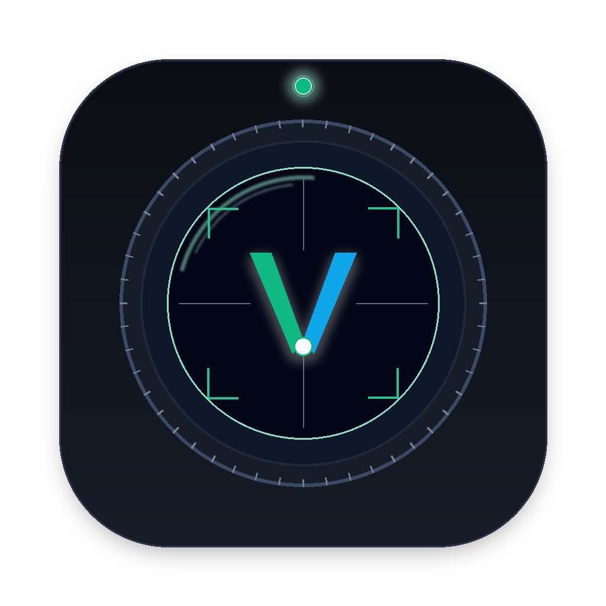
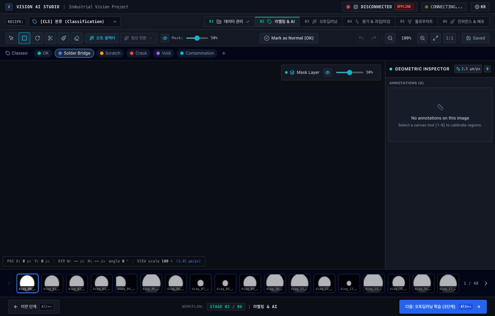
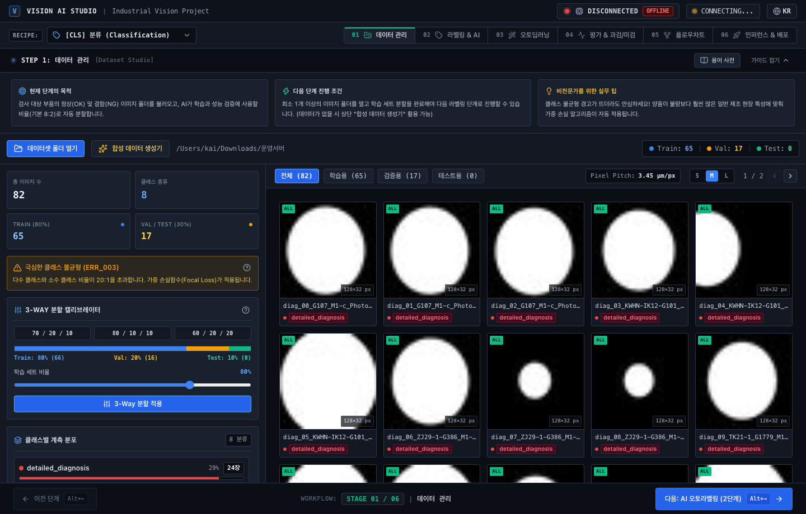
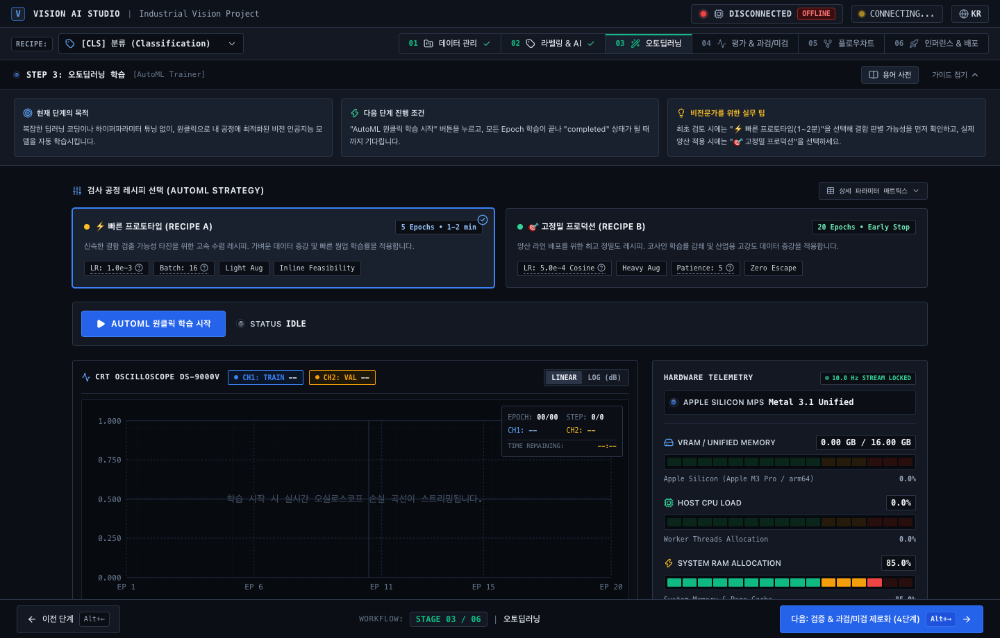
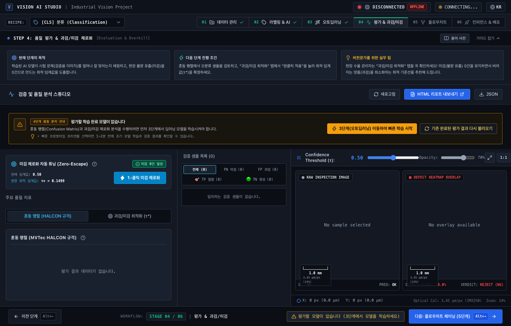
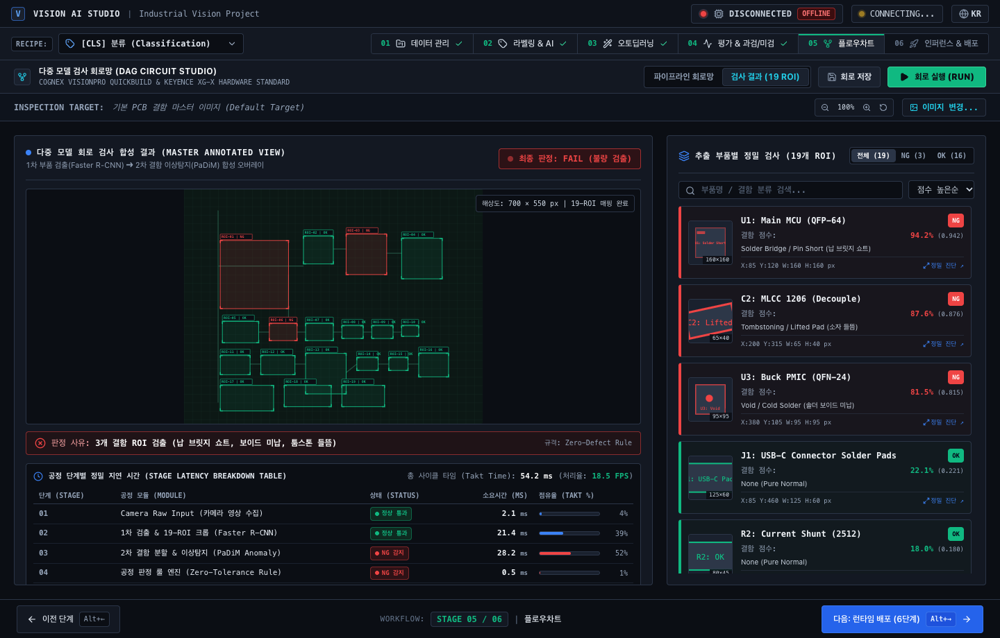
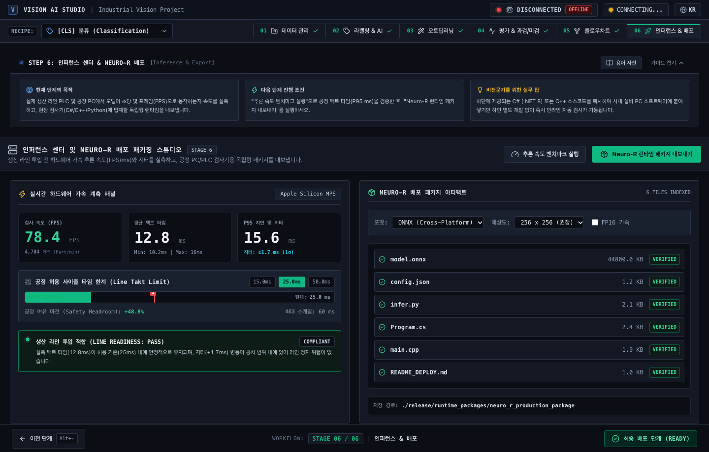

<div align="center">



# 👁️ Modu Vision (모두의 비전)
### 🚀 Universal No-Code Vision AI Training Studio
**코딩 없이 누구나 클릭 몇 번으로 완성하는 올인원 비전 AI 학습 플랫폼**

<br />

[-000000?style=for-the-badge&logo=apple&logoColor=white)](https://apple.com)
[-0078D6?style=for-the-badge&logo=windows&logoColor=white)](https://microsoft.com)
[](https://electronjs.org)
[](https://fastapi.tiangolo.com)
[](https://pytorch.org)
[](https://www.typescriptlang.org)
[](https://tailwindcss.com)
[](LICENSE)

<br />

[✨ 핵심 기능](#-핵심-기능-key-features) •
[📸 스튜디오 갤러리](#-스튜디오-갤러리-studio-gallery) •
[📊 솔루션 비교](#-산업용-솔루션-비교-comparison-matrix) •
[🏗 아키텍처](#-시스템-아키텍처-system-architecture) •
[⚡ 빠른 시작](#-빠른-시작-quick-start) •
[📦 독립 배포 (.exe / .app)](#-완전-독립형-배포-standalone-binary)

<br />

---

### 🖥️ Main Screen Preview


*Cognex ViDi / Keyence Vision 벤치마크 기반의 다크 스틸 인더스트리얼 테마 & 서브픽셀 정밀 검사 캔버스*

---

</div>

<br />

## 💡 프로젝트 소개 (Overview)

**Modu Vision(모두의 비전)**은 복잡한 딥러닝 코드나 인공지능 지식이 없어도 학생, 현장 실무자, 연구원, 엔지니어 등 **모든 사용자가 클릭 몇 번만으로 비전 AI 모델을 직접 학습시키고 활용할 수 있도록 설계된 올인원 노코드 머신비전 플랫폼**입니다.

데이터셋 업로드부터 초정밀 어노테이션(LabelMe 완벽 호환), 정상 이미지만으로 결함을 잡아내는 비지도 이상탐지(Anomaly Detection)를 포함한 원클릭 AutoML 학습, 불량 유출 제로(Zero-Escape) 판정 튜닝, 그리고 실제 라인 추론까지의 전 과정을 직관적인 데스크톱 GUI로 원스톱 지원합니다.

> [!IMPORTANT]
> **초보자 친화적 쉬운 사용성 + 산업 현장급 초고성능 동시 제공**:
> 직관적인 마우스 클릭 인터페이스를 제공하면서도, 내부적으로는 44.8MP(8,192 × 5,464) 초고해상도 기가픽셀 무손실 60fps 뷰포트와 PyTorch 기반 하드웨어 가속(Apple MPS / NVIDIA CUDA)을 지원하여 실제 공정 양산 라인에서도 즉시 도입할 수 있습니다.

<br />

## ✨ 핵심 기능 (Key Features)

### 🔍 1. 44.8MP 기가픽셀 RAW 렌더링 & 뷰포트 절두체 클리핑 (Frustum Blit)
* **초고해상도 무손실 렌더링**: 8192 × 5464 해상도의 거대 검사 이미지를 화질 저하 없이 원본 픽셀 그대로 화면에 로드.
* **GPU 텍스처 오버플로우 방지**: 8192px 이미지를 40배 확대 시 애플 메탈/윈도우 GPU 하드웨어 한계(16,384px)를 초과하지 않도록 **화면에 보이는 영역만 실시간 동적 슬라이싱(Frustum Blit)**하여 60fps 유지.
* **서브픽셀 1px 미세 결함 보존**: 배율 3.0x 이상 확대 시 안티에일리어싱을 끄고 크리스피한 최근접 이웃(Nearest-Neighbor) 픽셀 모드로 전환하여 1픽셀 미세 스크래치까지 명확히 검수.

### 🏷️ 2. LabelMe 포맷 네이티브 연동 & 7대 산업용 캔버스 도구
* **라벨미 JSON 원클릭 자동 연동**: 인접한 `.json` 파일의 결함 형상(`Bow`, `Scratch`, `Pollution`, `White Spot` 등)을 읽어와 다각형 윤곽선 및 클래스 팔레트에 자동 등록.
* **7대 정밀 도구**: 선택/이동(Select), 바운딩 박스(BBox), 회전 박스(OBB), 다각형(Polygon), 브러시(Brush), 지우개(Eraser), AI 오토 셀렉터(Magic Wand).
* **형상 상호 변환기 (Shape Converter)**: 클릭 한 번으로 BBox ➔ Polygon ➔ Mask ➔ Rotated OBB 자유 변환.
* **트랙패드 & 마우스 완벽 지원**:
  - Mac 트랙패드 핀치 줌 (`Math.exp(-deltaY * 0.008)`) & 두 손가락 2D 캔버스 부드러운 패닝.
  - 마우스 휠 커서 기준 줌 및 스페이스바 팬(Pan) 지원.

### 🤖 3. 산업용 4대 태스크 AutoML & 실시간 하드웨어 텔레메트리
* **비지도 이상탐지 (Unsupervised Anomaly Detection)**: 결함 라벨링 없이 **정상(OK) 제품 이미지만으로** 미세 결함을 찾아내는 PatchCore, PaDiM 탑재.
* **이미지 분류 / 객체 검출 / 시맨틱 세그멘테이션**: ResNet, ConvNeXt, YOLO, U-Net, DeepLabV3+ 모델 원클릭 파이프라인.
* **실시간 오실로스코프 Loss 곡선**: 학습 중 손실률 추이와 GPU VRAM, 전력 소비량(W), FPS 실시간 모니터링.
* **하드웨어 가속 자동 분기**: Apple Silicon Metal (MPS) 및 NVIDIA CUDA (12.x) 자동 감지 가속.

### 🛡️ 4. 불량 유출 0% 최적화 (Zero-Escape Tradeoff Optimizer)
* **과검(Over-kill) vs 유출(Escape) 대화형 튜닝**: 제품 결함이 외부로 단 하나도 유출되지 않도록(Recall 100%) 판정 임계값을 실시간 슬라이더로 조절.
* **혼동 행렬(Confusion Matrix) 드릴다운**: FP / FN 셀을 클릭하여 오분류된 제품 이미지만 즉시 필터링 및 2단 분할 뷰포트로 심층 비교.
* **원클릭 공정 검사 성적서(PDF Report)** 발행.

<br />

---

## 📸 스튜디오 갤러리 (Studio Gallery)

<table align="center" width="100%">
  <tr>
    <td width="50%" align="center">
      <b>Stage 1: 데이터 스튜디오 & 인공 결함 합성기</b><br />
      
      <p align="left"><sub>• 로컬 폴더 대량 로드, LabelMe 동기화, 절차적 인공 결함(균열, 쇼트, 기포) 자동 생성</sub></p>
    </td>
    <td width="50%" align="center">
      <b>Stage 2: 3-Layer 정밀 라벨링 캔버스</b><br />
      
      <p align="left"><sub>• 7대 산업용 벡터 도구, 서브픽셀 1px 단위 보정, 44.8MP 초고해상도 60fps Frustum Blit</sub></p>
    </td>
  </tr>
  <tr>
    <td width="50%" align="center">
      <b>Stage 3: AutoML 트레이너 & 하드웨어 텔레메트리</b><br />
      
      <p align="left"><sub>• 4대 태스크 원클릭 레시피, 오실로스코프 실시간 Loss 뷰, Apple MPS / NVIDIA CUDA 가속</sub></p>
    </td>
    <td width="50%" align="center">
      <b>Stage 4: 불량 유출 제로(Zero-Escape) 판정 스튜디오</b><br />
      
      <p align="left"><sub>• 혼동 행렬 오분류 심층 드릴다운, 이상치 히트맵 시각화, 품질 검사 성적서 원클릭 출력</sub></p>
    </td>
  </tr>
  <tr>
    <td width="50%" align="center">
      <b>Stage 5: 다단계 검사 플로우차트 DAG 파이프라인</b><br />
      
      <p align="left"><sub>• 다단 검사 공정(Alignment ➔ Crop ➔ Defect Detection) 노드 기반 시각적 회로 설계</sub></p>
    </td>
    <td width="50%" align="center">
      <b>Stage 6: 실시간 추론 센터 & 현장 디바이스 가속</b><br />
      
      <p align="left"><sub>• 라인 단말기 연동 실시간 판정, 카메라 스트리밍 인퍼런스, 양/불량(OK/NG) 신호 제어</sub></p>
    </td>
  </tr>
</table>

<br />

---

## 📊 산업용 솔루션 비교 (Comparison Matrix)

| 비교 항목 | **Modu Vision (모두의 비전)** | Cognex ViDi Suite | Keyence IV / XG | Label Studio / Roboflow |
| :--- | :---: | :---: | :---: | :---: |
| **44.8MP 기가픽셀 RAW 렌더링** | **✅ 무손실 60fps (Frustum Blit)** | ⚠️ 대용량 시 래그 발생 | ❌ 특정 센서 제한 | ❌ 웹 브라우저 메모리 폭발 |
| **LabelMe JSON 포맷 네이티브 연동** | **✅ 자동 파싱 및 팔레트 매핑** | ❌ 전용 포맷 변환 필요 | ❌ 전용 포맷 변환 필요 | ⚠️ 수동 플러그인 필요 |
| **인터넷 없는 폐쇄망 완전 독립 실행** | **✅ 100% Standalone (.exe/.app)** | ⚠️ 동글키 하드웨어 락 | ⚠️ 전용 컨트롤러 종속 | ❌ 클라우드/웹 서버 필수 |
| **불량 유출 0% (Zero-Escape) 튜닝** | **✅ 전용 트레이드오프 슬라이더** | ⚠️ 복잡한 파라미터 튜닝 | ⚠️ 이진 임계값만 지원 | ❌ 단순 mAP/F1만 표시 |
| **절차적 인공 결함 자동 생성기** | **✅ 내장 (균열/쇼트/기포 합성)** | ❌ 미지원 | ❌ 미지원 | ⚠️ 단순 이미지 반전/노이즈 |
| **플랫폼 하드웨어 가속** | **Apple MPS & NVIDIA CUDA** | Windows 전용 | 전용 임베디드 OS | 서버 환경 의존 |
| **라이선스 및 도입 비용** | **오픈소스 (MIT)** | 수천만원 고가 라이선스 | 수천만원 전용 장비 구매 | 월 구독료 플랜 |

<br />

---

## 🏗 시스템 아키텍처 (System Architecture)

```
┌─────────────────────────────────────────────────────────────────────────────┐
│                 Desktop Client Layer (Electron 33 + React 18)               │
│   ┌───────────────────────┐ ┌────────────────────────┐ ┌────────────────┐  │
│   │ 4-Stage Wizard UI     │ │ 3-Layer Canvas Engine  │ │ Zustand Stores │  │
│   │ (Data/Canvas/AutoML)  │ │ (Base/Mask/Vector L3)  │ │ (Sync State)   │  │
│   └───────────────────────┘ └────────────────────────┘ └────────────────┘  │
└──────────────────────────────────────┬──────────────────────────────────────┘
                                       │ IPC / WebSocket Telemetry
┌──────────────────────────────────────▼──────────────────────────────────────┐
│             Native Child Process Lifecycle Supervisor (supervisor.ts)        │
│   ┌───────────────────────────────────┐ ┌────────────────────────────────┐  │
│   │ Standalone Binary Direct Exec     │ │ Dependency Auto-Bootstrapper   │  │
│   │ (vision_ai_backend.exe 우선 실행) │ │ (bootstrap_env.py 자가 치유)   │  │
│   └───────────────────────────────────┘ └────────────────────────────────┘  │
└──────────────────────────────────────┬──────────────────────────────────────┘
                                       │ REST / WebSocket (Port 0 Ephemeral)
┌──────────────────────────────────────▼──────────────────────────────────────┐
│                    FastAPI Backend Daemon & AI Engine                       │
│   ┌───────────────────────┐ ┌────────────────────────┐ ┌────────────────┐  │
│   │ Dataset / Annotations │ │ PyTorch Models Engine  │ │ Subpixel Math  │  │
│   │ (LabelMe Auto-Parser) │ │ (PatchCore, YOLO, etc) │ │ & Bounding Box │  │
│   └───────────────────────┘ └────────────────────────┘ └────────────────┘  │
└──────────────────────────────────────┬──────────────────────────────────────┘
                                       │ Hardware Direct Compute
┌──────────────────────────────────────▼──────────────────────────────────────┐
│       Apple Silicon Metal (MPS)  │  NVIDIA CUDA 12.x  │  Intel/AMD Multi-CPU│
└─────────────────────────────────────────────────────────────────────────────┘
```

<br />

---

## ⚡ 빠른 시작 (Quick Start)

### 필수 요구 조건
* **Node.js**: v18.0.0 이상
* **Python**: 3.10 이상 (3.11, 3.12, 3.13 완벽 지원)
* **OS**: macOS 12+ (Apple Silicon) 또는 Windows 10/11 (64-bit)

### 저장소 복제 및 설치
```bash
# 1. 저장소 복제
git clone https://github.com/USER/modu-vision.git
cd modu-vision

# 2. 파이썬 가상환경 생성 및 의존성 설치
python -m venv .venv
source .venv/bin/activate  # Windows: .venv\Scripts\activate
pip install -r requirements.txt

# 3. 프론트엔드 모듈 설치
npm install
```

### 개발 모드 실행
```bash
# UI와 백엔드 데몬을 동시에 핫 리로드 모드로 실행
npm run dev
```

<br />

---

## 📦 완전 독립형 배포 (Standalone Binary)

본 프로젝트는 현장 배포 시 사용자의 PC에 **파이썬이나 라이브러리가 전혀 설치되어 있지 않아도 더블 클릭 한 번으로 실행되는 완전 무설치 단일 바이너리 배포**를 지원합니다.

### 🍎 macOS 애플리케이션 번들 (.app)
```bash
npm run build
npm run package:mac
# 출력 위치: release/mac-arm64/Vision AI Studio.app
```
> **Gatekeeper 보안 격리 해제 팁**: 애플 미공증 앱을 다운로드하여 실행할 때 `"손상된 파일입니다"` 경고가 뜰 경우, 터미널에서 다음 명령어를 실행하면 즉시 해제됩니다:
> ```bash
> xattr -cr "/Applications/Vision AI Studio.app"
> ```

### 🪟 Windows 단일 설치 파일 (Setup.exe)
```bash
# 1. 파이썬 소스코드를 단일 바이너리(vision_ai_backend.exe)로 기계어 컴파일
npm run build:backend

# 2. 윈도우 NSIS 인스톨러 생성 (VC++ 런타임 무인 자동 설치 스크립트 포함)
npm run package:win
# 출력 위치: release/Vision AI Studio Setup 0.1.0.exe
```

<br />

---

## ⌨️ 키보드 & 마우스 단축키 일람 (Cheatsheet)

| 단축키 | 동작 | 설명 |
| :---: | :--- | :--- |
| `1` ~ `7` | **도구 전환** | 1: 선택, 2: BBox, 3: OBB, 4: 폴리곤, 5: 브러시, 6: 지우개, 7: 오토 셀렉터 |
| `트랙패드 핀치` | **커서 중심 스무스 줌** | 두 손가락으로 모으거나 벌려 부드럽게 지수 확대/축소 |
| `트랙패드 2손가락` | **2D 캔버스 팬(Pan)** | 마우스 없이 두 손가락 드래그로 상하좌우 화면 이동 |
| `Space` + `드래그` | **화면 패닝 (Pan)** | 스페이스바를 누른 채 마우스 좌클릭 드래그로 캔버스 이동 |
| `F` | **화면 맞춤 (Fit)** | 현재 이미지를 화면 정중앙에 꽉 차게 자동 배율 조정 |
| `1` (넘버패드/메뉴) | **100% 배율 (1:1)** | 이미지의 실제 1픽셀을 모니터 1픽셀에 1:1로 원본 매핑 |
| `방향키 (↑, ↓, ←, →)` | **1px 서브픽셀 넛지** | 선택된 BBox/폴리곤을 1픽셀 단위로 정밀 미세 이동 |
| `Shift` + `방향키` | **10px 단위 고속 넛지** | 선택된 어노테이션을 10픽셀 단위로 이동 |
| `Delete` / `Backspace` | **삭제** | 선택된 결함 어노테이션 제거 |
| `Ctrl` / `Cmd` + `Z` | **실행 취소 (Undo)** | 최대 40단계 히스토리 롤백 |
| `Enter` | **폴리곤 완성** | 다각형 그리기 중 시작점으로 닫기 |
| `Esc` | **작업 취소** | 현재 드래프팅 취소 및 선택 해제 |

<br />

---

## 🧪 테스트 무결성 검증 (Verification Suite)

프로덕션 배포 전 100% 합격 검증을 거친 무결성 테스트 스위트:

```bash
# 1. 백엔드 PyTorch / FastAPI E2E 검증 (89 / 89 Passed)
python -m pytest tests/

# 2. 프론트엔드 아키텍처 및 캔버스 정합성 검증 (100 / 100 Passed)
node scripts/verify-m5.js

# 3. 크로스 플랫폼 데스크톱 패키징 검증 (26 / 26 Passed)
node scripts/verify-packaging.js
```

<br />

---

## 📁 프로젝트 레이아웃 (Repository Layout)

```
modu-vision/
├── 📂 assets/                     # 고해상도 로고 및 6단계 스튜디오 스크린샷
├── 📂 backend/                    # Python 3 / FastAPI 백엔드 데몬
│   ├── 📂 api/                    # REST 엔드포인트 및 WebSocket 원격 측정
│   ├── 📂 engine/                 # PyTorch 모델 (PatchCore, YOLO, U-Net) 및 합성기
│   └── 📂 utils/                  # 2개 국어 에러 카탈로그 및 공통 유틸리티
├── 📂 src/                        # 프론트엔드 및 Electron 소스
│   ├── 📂 main/                   # Electron 메인 프로세스 & 프로세스 감시자(Supervisor)
│   ├── 📂 preload/                # 보안 Context Bridge IPC 프리로드
│   └── 📂 renderer/               # React 18 / TailwindCSS 산업용 UI 컴포넌트
├── 📂 build/                      # 윈도우/맥 고해상도 아이콘 (ico, icns) 및 인스톨러 스크립트
├── 📂 scripts/                    # 자동화 부트스트랩, 바이너리 컴파일러, 검증 스크립트
├── 📂 tests/                      # E2E 적대적 테스트 및 단위 테스트 스위트
├── 📄 electron-builder.yml        # macOS DMG 및 Windows NSIS 크로스 패키징 스펙
├── 📄 requirements.txt            # 파이썬 의존성 명세서
└── 📄 package.json                # Node.js 프로젝트 명세서
```

<br />

---

## 🤝 기여하기 (Contributing)

버그 제보, 기능 제안 및 풀 리퀘스트(PR)는 언제나 환영합니다!
1. 이슈를 등록하여 구현 계획을 논의해 주세요.
2. 피처 브랜치를 생성합니다 (`git checkout -b feature/amazing-feature`).
3. 변경 사항을 커밋합니다 (`git commit -m 'feat: Add amazing feature'`).
4. 브랜치에 푸시합니다 (`git push origin feature/amazing-feature`).
5. 풀 리퀘스트(PR)를 오픈합니다.

<br />

---

## 📄 라이선스 (License)

This project is licensed under the **MIT License** - see the [LICENSE](LICENSE) file for details.

<div align="center">
  <sub>Built with ❤️ by the Modu Vision Open Source Team.</sub>
</div>
