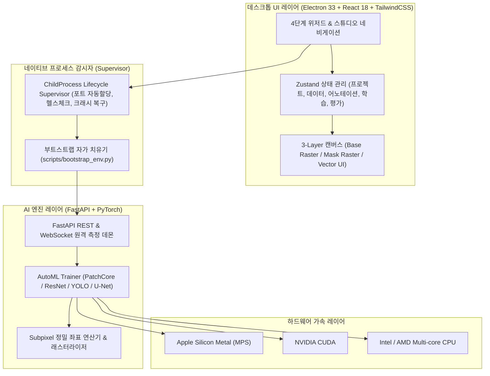

<div align="center">

# 🔬 Vision AI Studio
### Industrial No-Code Deep Learning Vision Inspection Platform
**차세대 제조 공정(반도체, HBM, 세라믹, PCB, 2차전지)을 위한 노코드 머신비전 AI 학습 및 검사 솔루션**

[-000000?style=for-the-badge&logo=apple&logoColor=white)](https://apple.com)
[-0078D6?style=for-the-badge&logo=windows&logoColor=white)](https://microsoft.com)
[](https://electronjs.org)
[](https://fastapi.tiangolo.com)
[](https://pytorch.org)
[](https://www.typescriptlang.org)
[](https://tailwindcss.com)
[](LICENSE)

<br />

**Inspection Vision Model / Industrial Vision** 벤치마크 기반의 전문가용 산업용 UI를 채택하여,  
코딩 지식 없이도 **데이터 업로드 ➔ 초고해상도 라벨링 ➔ AutoML 모델 학습 ➔ 불량 유출 제로(Zero-Escape) 임계값 판정**까지 전 과정을 단일 데스크톱 앱에서 원스톱으로 수행합니다.

</div>

---

## 🌟 핵심 특징 (Key Highlights)

* **44.8MP 초고해상도 RAW 기가픽셀 렌더링**: 8192 × 5464 해상도 산업용 카메라 원본 이미지를 무손실 60fps로 실시간 확대/축소.
* **뷰포트 절두체 클리핑(Frustum Blit)**: 8192px 이미지를 40배 확대 시 발생하는 GPU 텍스처 한계(16,384px) 초과 문제를 화면 영역만 동적 클리핑하여 원천 차단.
* **Apple Mac & Windows 완벽 대응**:
  - Mac: 트랙패드 부드러운 핀치 줌 (`Math.exp`) & 두 손가락 2D 패닝, Apple Silicon Metal (MPS) 하드웨어 가속.
  - Windows: NVIDIA CUDA 12.x 가속, MSVC C++ 런타임 무인 자동 설치 및 단일 `.exe` 무설치 독립 패키징.
* **LabelMe 포맷 네이티브 연동**: 기존 산업 현장의 LabelMe JSON 어노테이션 파일 자동 파싱 및 8종 결함 클래스 색상 팔레트 자동 동기화.
* **하드웨어 가속 AutoML**: 결함 없는 정상 데이터만으로 학습하는 비지도 이상탐지(PatchCore, PaDiM)부터 분류, 객체 검출, 결함 세분화까지 4대 태스크 지원.
* **불량 유출 0% 판정(Zero-Escape Optimizer)**: 과검(Over-kill)과 유출(Escape)의 트레이드오프 곡선을 제공하여 현장 맞춤형 판정 임계값 실시간 튜닝.

---

## 🏗 시스템 아키텍처 (Architecture)



---

## 🛠 4-Stage 작업 파이프라인 (Workflows)

| 단계 | 명칭 | 주요 기능 |
| :---: | :--- | :--- |
| **Stage 1** | **데이터 스튜디오 (Data Studio)** | • 폴더 선택을 통한 로컬 이미지 대량 수집<br>• LabelMe `.json` 자동 로드 및 클래스 추출<br>• 절차적 인공 결함 생성기 (균열, 스크래치, 기포, 납땜 쇼트 합성)<br>• Train / Val 데이터 자동 분할 (8:2 등) |
| **Stage 2** | **정밀 라벨링 캔버스 (Canvas Studio)** | • 3-Layer 고성능 렌더링 캔버스<br>• 7대 산업용 도구: BBox, OBB(회전 박스), 다각형 폴리곤, 브러시, 지우개, AI 오토 셀렉터, 형상 상호 변환기<br>• 1px 미세 결함 보존 서브픽셀 정밀 어노테이션<br>• 다각형 드래그 이동 및 마우스 휠/트랙패드 자연스러운 줌/팬 |
| **Stage 3** | **AutoML 학습 컨트롤러 (Training Studio)** | • 4대 태스크 (비지도 이상탐지, 이미지 분류, 객체 검출, 세그멘테이션)<br>• 원클릭 레시피 프리셋 (초고속 검증 vs 최고 정확도)<br>• 오실로스코프 실시간 Loss 곡선 및 GPU/VRAM 텔레메트리<br>• Apple M3 MPS / NVIDIA CUDA 가속 자동 분기 |
| **Stage 4** | **산업용 결함 판정 스튜디오 (Decision Studio)** | • 혼동 행렬(Confusion Matrix) 오분류 셀 원클릭 심층 분석<br>• 비지도 이상치 히트맵(Heatmap) 및 결함 경계 가시화<br>• 불량 유출 제로(Zero-Escape) 최적화 슬라이더<br>• 원클릭 품질 보증 검사 성적서(PDF Report) 발행 |

---

## 🚀 빠른 시작 가이드 (Quick Start)

### 1. 요구 사항
* **Node.js**: v18.0.0 이상
* **Python**: 3.10, 3.11, 3.12 또는 3.13
* **OS**: macOS 12+ (Apple Silicon) 또는 Windows 10/11 (64-bit)

### 2. 저장소 복제 및 설치

```bash
# 1. 저장소 복제
git clone https://github.com/USER/vision-ai-studio.git
cd vision-ai-studio

# 2. 파이썬 백엔드 가상환경 설정 및 의존성 설치
python -m venv .venv
source .venv/bin/activate  # Windows: .venv\Scripts\activate
pip install -r requirements.txt

# 3. 프론트엔드 모듈 설치
npm install
```

### 3. 개발 모드 실행

```bash
# UI 및 파이썬 백엔드 데몬 동시 구동
npm run dev
```

---

## 📦 프로덕션 패키징 및 단일 실행 파일(`.exe` / `.app`) 제작

### 🍎 macOS 애플리케이션 번들 빌드
```bash
# 빌드 및 mac-arm64 디렉토리 번들 생성
npm run build
npm run package:mac
# 결과물: release/mac-arm64/Vision AI Studio.app
```

### 🪟 Windows 단일 설치 파일(Setup.exe) 빌드
```bash
# 1. 파이썬 소스코드를 암호화 컴파일된 단일 바이너리(vision_ai_backend.exe)로 패키징
npm run build:backend

# 2. 윈도우 NSIS 인스톨러 생성
npm run package:win
# 결과물: release/Vision AI Studio Setup 0.1.0.exe
```

> 💡 **무설치 Standalone 보장**: `npm run build:backend`를 거쳐 빌드된 윈도우 패키지는 파이썬이나 라이브러리가 전혀 설치되지 않은 순정 윈도우 PC에서도 더블 클릭만으로 100% 독립 실행됩니다.

---

## 🧪 테스트 무결성 검증 (Test Integrity)

본 프로젝트는 프로덕션 레벨의 무결성 검증 파이프라인을 통과했습니다:

```bash
# 1. 백엔드 PyTorch / FastAPI E2E 검증 (89개 테스트 통과)
python -m pytest tests/

# 2. 프론트엔드 아키텍처 및 무결성 테스트 (100개 항목 통과)
node scripts/verify-m5.js

# 3. 데스크톱 패키징 및 번들 정합성 검증 (26개 항목 통과)
node scripts/verify-packaging.js
```

---

## 📁 디렉토리 구조 (Repository Layout)

```
vision-ai-studio/
├── backend/                     # Python 3 / FastAPI 백엔드 데몬
│   ├── api/                     # REST 엔드포인트 및 WebSocket 원격 측정
│   ├── engine/                  # PyTorch 모델 (Anomaly, Det, Seg, Cls) 및 합성기
│   └── utils/                   # 2개 국어 에러 카탈로그 및 공통 유틸리티
├── src/                         # 프론트엔드 및 Electron 소스
│   ├── main/                    # Electron 메인 프로세스 & 프로세스 감시자(Supervisor)
│   ├── preload/                 # 보안 Context Bridge IPC 프리로드
│   └── renderer/                # React 18 / TailwindCSS 산업용 UI 컴포넌트
├── build/                       # 고해상도 앱 아이콘 (ico, icns) 및 인스톨러 스크립트
├── scripts/                     # 자동화 부트스트랩, 바이너리 컴파일러, 검증 스크립트
├── tests/                       # E2E 적대적 테스트 및 단위 테스트 스위트
├── electron-builder.yml         # macOS DMG 및 Windows NSIS 크로스 패키징 스펙
├── requirements.txt             # 파이썬 의존성 명세서
└── package.json                 # Node.js 프로젝트 명세서
```

---

## 📄 라이선스 (License)

This project is licensed under the MIT License - see the [LICENSE](LICENSE) file for details.
